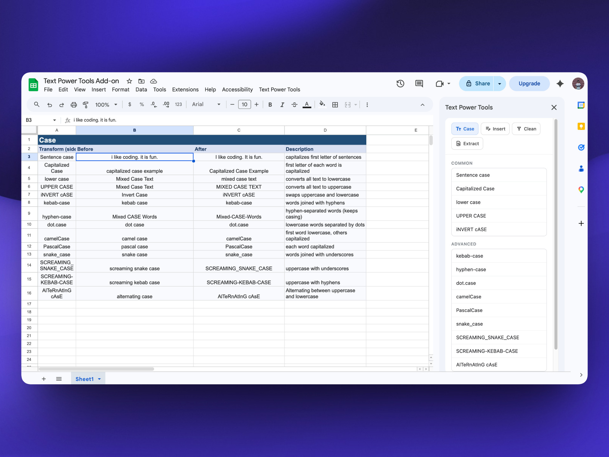
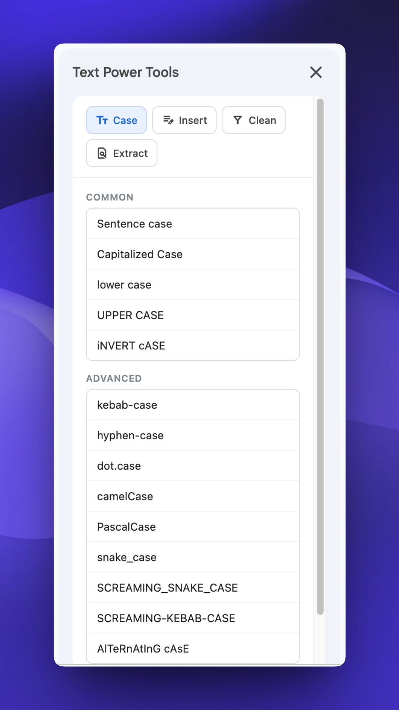
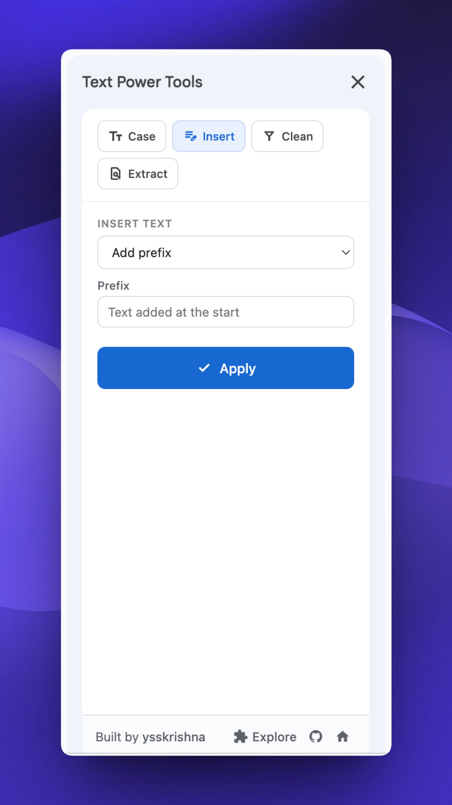
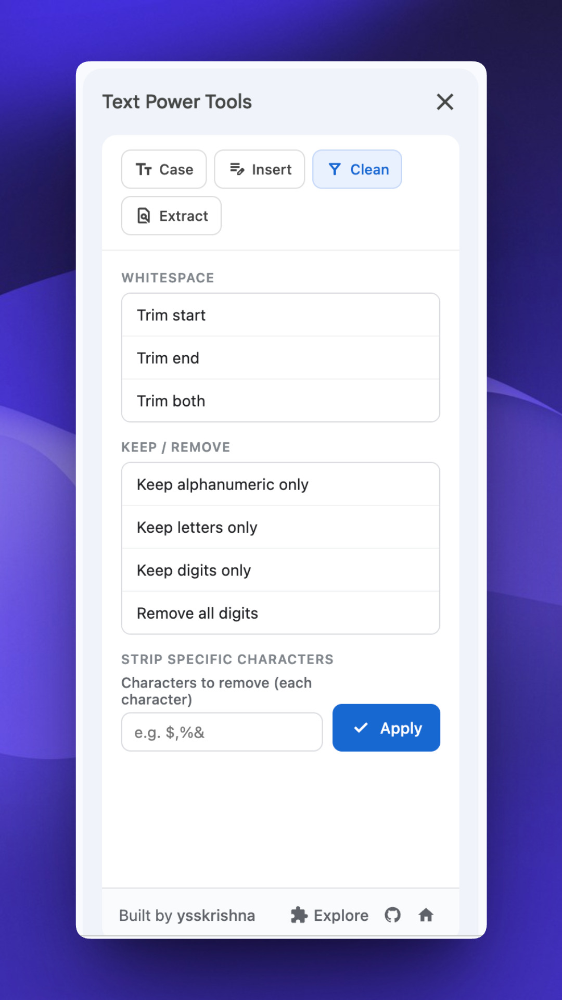
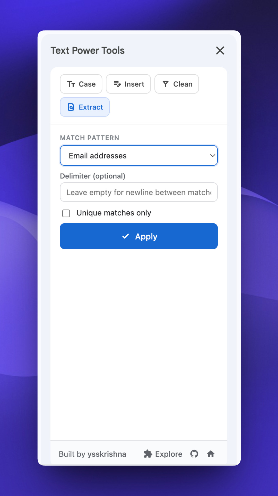

# Text Power Tools for Google Sheets

   

Text Power Tools is a Google Sheets add-on for cleaning and reshaping text directly in your spreadsheet. Select any range, open the sidebar, and apply case changes, insert or strip characters, or extract emails, URLs, dates, and more—without leaving the sheet.

## Getting started

After installation, use the **Text Power Tools** menu in the spreadsheet menu bar and choose **Start**. The sidebar opens with four tabs: **Case**, **Insert**, **Clean**, and **Extract**. Select the cells you want to change, choose an action, and click **Apply**.

Transforms run on the **active selection** and use each cell’s **displayed text** (what you see in the grid), then write the result back into those cells.

## Key features

### 1. Case

Change capitalization and programmer-style naming in one click.

**Common**

- **Sentence case** — Capitalize the start of sentences.
- **Capitalized Case** — First letter of each word uppercased.
- **lower case** / **UPPER CASE**
- **iNVERT cASE** — Swap upper and lower case per character.

**Advanced**

- **kebab-case**, **hyphen-case** (word-style hyphenation), **dot.case**
- **camelCase**, **PascalCase**
- **snake_case**, **SCREAMING_SNAKE_CASE**, **SCREAMING-KEBAB-CASE**
- **AlTeRnAtInG cAsE**

Programming-style cases split tokens from spaces, underscores, hyphens, dots, and camel boundaries when converting.

### 2. Insert

Add or inject text without formulas.

- **Add prefix** / **Add suffix** / **Add prefix and suffix** — Prepend, append, or both.
- **Insert at position** — Insert a string at a **1-based** character index (position `1` is before the first character; use **length + 1** to append at the end).

### 3. Clean

Trim and filter characters using Unicode-aware rules where noted.

**Whitespace**

- Trim start, trim end, or trim both ends.

**Keep / remove**

- **Keep alphanumeric only** — Letters and numbers (Unicode categories `\p{L}` and `\p{N}`).
- **Keep letters only** / **Keep digits only**
- **Remove all digits**

**Strip specific characters**

- Remove every occurrence of any character you list (for example currency or punctuation symbols).

### 4. Extract

Find patterns inside each cell and replace the cell’s contents with the matches joined together.

**Built-in presets**

- Email addresses
- URLs (`http` / `https`)
- Phone numbers (flexible international-style pattern)
- **#hashtags** and **@mentions** (Unicode-friendly; the hashtag preset may also match hex-like tokens such as `#FF5733`)
- Dates: **MM/DD/YYYY**, **DD-MM-YYYY**, **YYYY-MM-DD** (pattern-based, not full calendar validation)
- **24-hour time** — `HH:MM` with optional `:SS`

**Options**

- **Custom regex** — Your pattern; the add-on runs it with the global flag.
- **Delimiter** — How to join multiple matches (leave empty for newline between matches).
- **Unique matches only** — Deduplicate before joining.

## Why Text Power Tools

- Stays inside Google Sheets with a compact sidebar
- Covers everyday cleanup (trim, strip, case) and extraction (emails, URLs, tags)
- Respects what you see in cells (display values) for predictable results

## Screenshots

## Author

Built and maintained by **Y. Siva Sai Krishna**.

[Author's GitHub](https://github.com/ysskrishna) • [Author's LinkedIn](https://www.linkedin.com/in/ysskrishna) • [Product page](https://www.ysskrishna.space/google-sheets-text-power-tools/) • [Repository](https://github.com/ysskrishna/google-sheets-text-power-tools) • [Text Power Tools - Examples Workbook](https://docs.google.com/spreadsheets/d/1p-LPVYDIBFqkboDQUUswc8-F2ZEEDQ7jtP15WJ4dWSU/edit?usp=sharing)
